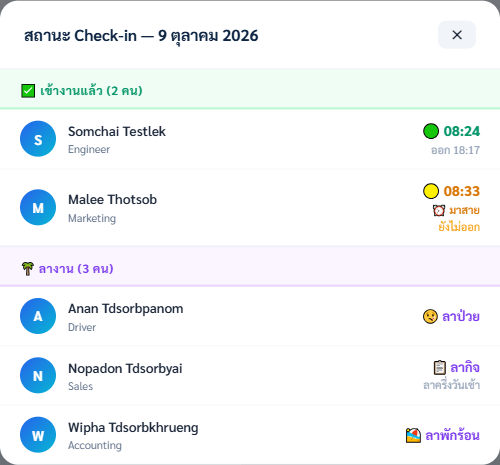
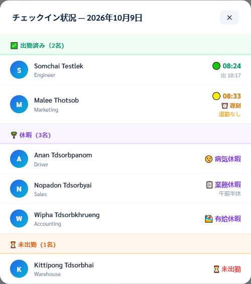
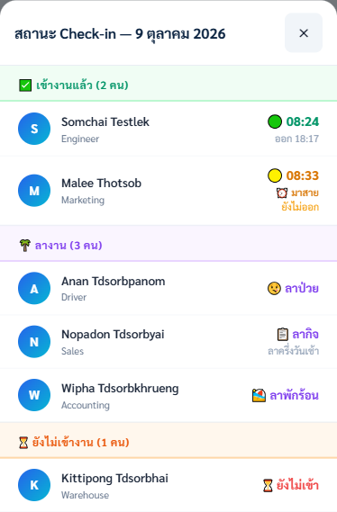

# Check-in Status: show who is on leave, and which leave

วันที่ 2026-10-09 · ตัดสินโดยเจ้าของ · สถานะ: อนุมัติแบบแล้ว ลงมือแล้ว

## ปัญหา

หน้า **สถานะ Check-in** (กดจากการ์ด "Check-in วันนี้" บนแดชบอร์ด) แบ่งพนักงานเป็น 2 กลุ่มจาก
`rec.checkIn` อย่างเดียว ใครไม่มีเวลาเข้างานวันนั้นจะตกไปอยู่ **"ยังไม่เข้างาน"** พร้อมข้อความ
สีแดง "⏳ ยังไม่เข้า" เหมือนกันหมด

เจ้าของเห็นของจริงเมื่อ 2026-10-09: พนักงานที่**ลางานและได้รับอนุมัติแล้ว** ขึ้นปนอยู่กับคนที่
ขาดงาน ⇒ เพื่อนร่วมงานที่เปิดดูแยกไม่ออกว่า "วันนี้ทำไมเขาไม่มา" คือลาหรือหายไปเฉยๆ ซึ่งเป็น
คำถามเดียวที่คนเปิดหน้านี้อยากรู้

คำสั่งเจ้าของ: ให้โชว์**ชนิดการลา** ไม่ใช่แค่คำว่า "ลา"

## คำตัดสิน

### 1. โชว์ชนิดการลาเต็ม ให้พนักงานทุกคนเห็น

เจ้าของเลือก "โชว์ชนิดเต็มกับทุกคน" หลังเห็นข้อมูลนี้: การ์ด **"วันลาวันนี้ 🌴"** อยู่แถวเดียวกับ
การ์ด Check-in บนแดชบอร์ด **ไม่ได้ซ่อนตาม role** (ต่างจากการ์ด "รอการอนุมัติ" ที่มี `display:none`)
และ `openTodayLeaveModal()` โชว์ชื่อ + ชนิดการลา + **เหตุผล** ให้ทุกคนอยู่แล้ว

⇒ การเอาชนิดการลาไปวางในหน้า Check-in **ไม่ได้เปิดเผยอะไรใหม่** แค่ย้ายข้อเท็จจริงไปไว้ตรงจุด
ที่คนตั้งคำถาม

### 2. ไม่โชว์เหตุผลการลาในหน้านี้

เหตุผลอยู่ที่หน้า "วันลาวันนี้" แล้ว หน้านี้ขอบเขตแค่ "ลาอะไร" ไม่ใช่ "ทำไม"

### 3. คนลาครึ่งบ่ายที่เข้างานเช้าแล้ว ยังอยู่กลุ่ม "เข้างานแล้ว"

เขามาทำงานจริง การย้ายเขาไปกลุ่ม "ลางาน" จะลบข้อเท็จจริงที่ว่าเขาเข้างานแล้ว และไม่ใช่ปัญหา
ที่เจ้าของเจอ

### 4. ไม่แตะการ์ดตัวเลข "Check-in วันนี้"

มันนับจาก `expectedToday` ซึ่งหักคนลาเต็มวันออกไปแล้วถูกต้องอยู่ (ดูคอมเมนต์ 2026-08-06
ที่ `updateDashboardStats`) — คนละทางกับหน้านี้ และไม่ได้ผิด

### 5. ไม่แตะ abroad / upcountry / holiday-work

ขอบเขตคือการลาส่วนตัว 3 ชนิด (`annual` / `sick` / `business`) ตามที่ `getTodayPersonalLeaves()`
นิยามไว้แล้ว

## สิ่งที่ทำ

`getCheckinStatusLists()` คืน **3 กลุ่ม** แทน 2: `checkedIn`, `onLeave`, `notChecked`

กฎการจัดกลุ่ม:

1. มีเวลาเข้างาน → `checkedIn` (เหมือนเดิมทุกประการ)
2. ไม่มีเวลาเข้างาน **และ** มีใบลาอนุมัติครอบวันนี้ → `onLeave` พร้อม `leave` และ `coverage`
3. นอกนั้น → `notChecked`

**ใช้ของที่มีอยู่แล้วทั้งหมด ไม่สร้างกฎใหม่:**

| ใช้ | ทำไม |
|---|---|
| `getTodayPersonalLeaves()` | นิยาม "ลาวันนี้" อยู่ที่เดียว และกรองประชากรชุดเดียวกับหน้านี้เป๊ะ (`isEmployeeRecord`, `active`, ไม่ใช่ MD) ⇒ หน้านี้กับตัวเลข "วันลาวันนี้" บนแดชบอร์ดขัดกันเองไม่ได้ |
| `leaveDayCoverage()` | แยกเต็มวัน / ครึ่งเช้า / ครึ่งบ่าย / บางส่วน |
| `getLEAVE_TYPE_CFG()` | ไอคอนกับชื่อชนิดการลา ⇒ หน้านี้คิดคำเองไม่ได้ ไม่แตกกับหน้าอื่น |
| ข้อความ `'morning half-day'` / `'afternoon half-day'` | ใช้สตริงเดียวกับตารางเวลาทำงาน ⇒ `ja.js` แปลไว้แล้ว (`午前半休` / `午後半休`) ไม่ต้องเพิ่มคำแปลใหม่ |

หัวข้อกลุ่มใหม่ **🌴 ลางาน (n คน)** คั่นระหว่าง "เข้างานแล้ว" กับ "ยังไม่เข้างาน" ครบ 3 ภาษา
(TH `ลางาน` / EN `On Leave` / JA `休暇`) และหัวข้อ "ยังไม่เข้างาน" หายไปเองเมื่อเหลือ 0 คน
ตามพฤติกรรมเดิม

## การพิสูจน์

**เทสต์:** `tests/checkin-status-leave.test.js` — 10 ข้อ **เขียนก่อนแก้โค้ดและพิสูจน์ว่าแดงจริง**
ก่อนลงมือ เทสต์ยึด*กฎการจัดกลุ่ม* ไม่ใช่ HTML จึงกันการถอยกลับไปเป็น 2 กลุ่มได้

กับดัก 2 อย่างที่เจอระหว่างเขียนเทสต์ และบันทึกไว้ในไฟล์เทสต์แล้ว:

- **ลิสต์ที่คืนจาก `vm` อยู่คนละ realm** ⇒ `deepStrictEqual` เทียบ prototype แล้วไม่ตรง
  ทั้งที่ค่าเหมือนกัน (`[1]` vs `[1]` แดง) ⇒ ต้อง `Array.from()` กลับเข้า realm ของเทสต์ก่อนเทียบ
  **นี่คือ "เทสต์แดงด้วยเหตุผลที่ไม่ใช่ของจริง"** ซึ่งถ้าปล่อยไว้จะไล่ผิดทางหลังแก้โค้ดเสร็จ
- **ค่าคงที่ของกฎครึ่งวัน** (`LUNCH_START_MIN` ฯลฯ) ดึงจาก `app.js` ด้วย `extractConst()`
  ไม่พิมพ์ตัวเลขซ้ำในเทสต์ ⇒ ถ้าใครแก้เวลาพักเที่ยงในโค้ด เทสต์เดินตามเอง

**เบราว์เซอร์ (Playwright, ข้อมูลสมมติล้วน ไม่ใช่พนักงานจริง):** เสิร์ฟ `attendance/` จาก worktree
แบบ static ไม่มี backend แล้วป้อนข้อมูลเข้าไปเรียกหน้าต่างตรงๆ — ยืนยัน:

- ขึ้นครบทั้ง 3 กลุ่มพร้อมกัน เรียงถูกลำดับ
- ไทย / อังกฤษ / ญี่ปุ่น แสดงครบทุกคำ รวมป้ายครึ่งวัน
- ไม่มีคำว่าเหตุผลหลุดออกมา
- จอมือถือ 390px ไม่ล้นแนวนอน (374 = 374)

ภาพที่ถ่ายไว้ (ชื่อคนในภาพเป็นชื่อสมมติทั้งหมด ไม่ใช่พนักงานจริง):

| ภาพ | แสดงอะไร |
|---|---|
|  | ภาษาไทย — กลุ่ม "ลางาน" พร้อมชนิดการลาและป้ายครึ่งวัน · กลุ่ม "ยังไม่เข้างาน" หายไปเองเมื่อเหลือ 0 คน |
|  | ภาษาญี่ปุ่น — ครบทั้ง 3 กลุ่มพร้อมกัน (`出勤済み` / `休暇` / `未出勤`) และ `午前半休` |
|  | จอ 390px — ไม่ล้นแนวนอน |

## ขอบเขตที่ตั้งใจไม่ครอบ (ไม่ใช่บั๊ก แต่ต้องรู้)

- **ลาชนิดอื่นที่ไม่ใช่ `annual`/`sick`/`business`** — เช่น `abroad`, `upcountry`, `holiday-work` —
  คนที่มีรายการพวกนี้วันนี้และยังไม่ลงเวลา **จะยังขึ้นว่า "ยังไม่เข้า" เหมือนเดิม** เพราะ
  `getTodayPersonalLeaves()` นิยามไว้แค่ 3 ชนิด ถ้าอยากให้ครอบด้วย ต้องตัดสินแยกว่าแต่ละชนิด
  ควรนับเป็น "ลางาน" หรือ "ไปทำงานที่อื่น" ซึ่งไม่ใช่เรื่องเดียวกัน
- **คนที่มีใบลาอนุมัติหลายใบในวันเดียวกัน** — แถวจะโชว์ใบแรกที่เจอ ระบบไม่ได้ห้ามกรณีนี้ไว้
  แต่ยังไม่เคยเกิด และยังไม่มีการตัดสินว่าควรโชว์ยังไง

**cache-buster:** `APP_BUILD` 94 → 95, `app.js?v=20261008i` → `20261009a`

## สิ่งที่พลาดระหว่างทำงานนี้ และต้องไม่ให้เกิดอีก

ตอนจะตรวจหน้าจอ ผมสั่ง `preview_start` แล้ว**ไม่ได้ตรวจว่ามันสตาร์ทอะไรกลับมา** — มันไปหยิบ
config `attendance-backend` จาก `Z:\.claude\launch.json` ซึ่งสั่ง `npm start` ที่
`Time_Attendance/attendance-server/backend` = **backend production ชี้ข้อมูลจริงบน NAS**
รันซ้อนกับตัวจริงอยู่ ~6 นาที (20:32–20:38)

ตรวจความเสียหายแล้ว: `settings.json` / `notifications.json` / `leaves.json` / `users.json`
เวลาไม่ขยับ · `events.json` เป็นพนักงานผ่านประตูจริง (เจ้าของยืนยัน) · ไม่มีไฟล์ไหนพัง
ทุกไฟล์ parse ได้ · `push-subscriptions.json` มีแถวใหม่ของบัญชี `System Administrator`
ซึ่งเป็นของเบราว์เซอร์อัตโนมัติ ไม่ใช่พนักงาน

แก้ต้นเหตุแล้ว: `Z:\.claude\launch.json` ไม่มี config backend อีกต่อไป เหลือเฉพาะเซิร์ฟเวอร์
static ที่ชี้ worktree (ของเดิมสำรองที่ `launch.json.bak-2026-10-09`)

**บทเรียน: ผลลัพธ์ของ `preview_start` ต้องอ่านก่อนปล่อยให้รันต่อ — ชื่อที่ขอไปกับชื่อที่ได้มา
ไม่จำเป็นต้องตรงกัน**
